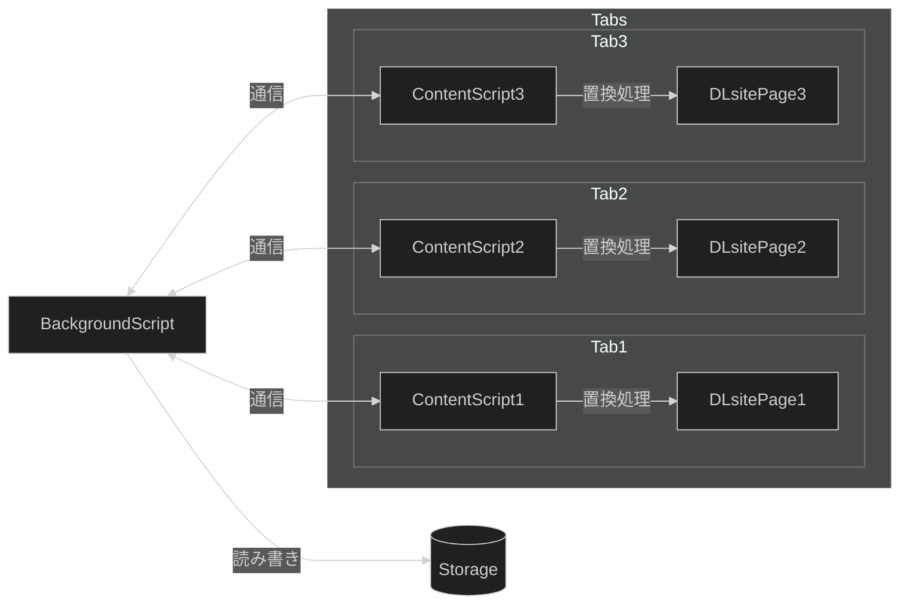
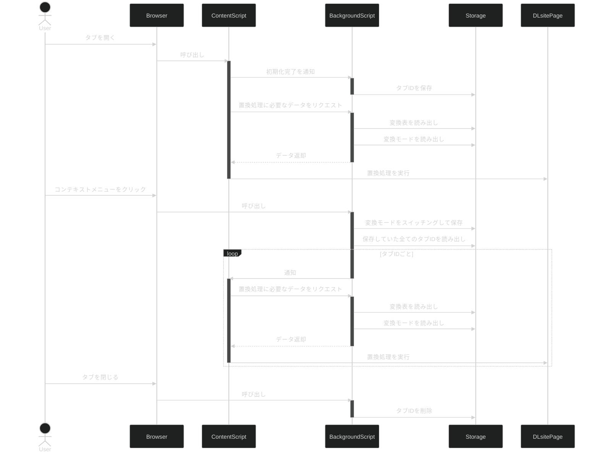

# DLsite GenreTag Replacer <!-- omit in toc -->

- [本拡張機能に関して](#本拡張機能に関して)
  - [機能](#機能)
  - [対応ブラウザ](#対応ブラウザ)
  - [対応ページ](#対応ページ)
  - [変換用語一覧](#変換用語一覧)
- [開発環境](#開発環境)
  - [セットアップ方法](#セットアップ方法)
  - [ビルド方法](#ビルド方法)
- [設計資料](#設計資料)
  - [概念図](#概念図)
  - [シーケンス図](#シーケンス図)
- [リンク](#リンク)

## 本拡張機能に関して

[DLsite.com](https://www.dlsite.com/index.html)において 2024年3月 に行われた、ジャンルタグの表記置き換えに対処するための拡張機能です。

### 機能

- ジャンルタグを旧版（例：メスガキ）で表示
- 検索結果ページに限って、タブタイトルに表示されるジャンルタグの名称を旧版で表示
- コンテキストメニューからの新版・旧版切り替え（複数タブに反映）

### 対応ブラウザ

- Chrome
- Firefox
- Edge

### 対応ページ

- [検索結果ページ](https://www.dlsite.com/maniax/fsr/=/order/trend/genre[0]/525/options[0]/JPN/options[1]/NM/from/work.genre)
- [商品ページ](https://www.dlsite.com/books/work/=/product_id/BJ01328905.html)
- [こだわり検索ページ](https://www.dlsite.com/books/fs)

### 変換用語一覧

[jsonファイル](./assets/genre-word-conversion-map-ja.json)をご参照ください。

## 開発環境

開発にあたっては[TypeScript](https://www.typescriptlang.org/)を使用しています。また、以下の利用を前提としています。

- [VSCode](https://code.visualstudio.com/)
- [WSL2](https://learn.microsoft.com/en-us/windows/wsl/install)

### セットアップ方法

**WSL2** 上で、以下をインストールします。

- [Node Version Manager](https://github.com/nvm-sh/nvm)

    ```sh
    curl -o- https://raw.githubusercontent.com/nvm-sh/nvm/master/install.sh | bash
    source ~/.bashrc
    ```

- [Node.js](https://nodejs.org/en)（現時点ではLTSのバージョンは`v20.11.1`）

    ```sh
    nvm install --lts
    ```

- ビルドやバンドルに必要な`node_modules`

    ```sh
    npm ci
    ```

- [Gnu Make](https://www.gnu.org/software/make/)

    ```sh
    apt install -y make
    ```

- zip

  ```sh
  apt install -y zip
  ```

### ビルド方法

プロジェクトディレクトリ――`Makefile`が存在するディレクトリ――で以下を実行します。

```sh
make
```

## 設計資料

### 概念図



### シーケンス図



## リンク

- [TypeScript](https://www.typescriptlang.org/)
- [esbuild](https://esbuild.github.io/)
- [Web Extensions Reference (Firefox)](https://developer.mozilla.org/en-US/docs/Mozilla/Add-ons/WebExtensions)
- [Web Extensions Reference (Chrome)](https://developer.chrome.com/docs/extensions/reference)
